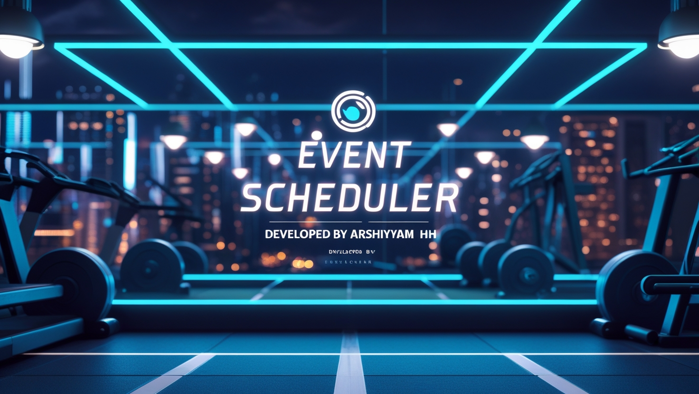

# Event Scheduler 🗓️🚀

A sleek and futuristic web app for managing events online. Built with HTML, CSS, and JavaScript, it offers an intuitive and efficient experience for scheduling and organizing events with a luxurious neon tech-inspired design.  
[Live Demo](https://arshiya-mh.github.io/Event-Scheduler/)

## 📌 Features
✅ User-friendly event scheduling and management 🗓️✨  
✅ Luxurious neon color palette with a tech-inspired design 🌌💡  
✅ Intuitive and interactive interface for easy event tracking 🎯  
✅ Efficient for both professionals and individuals 👥  
✅ Responsive layout for optimal viewing on all devices 📱💻

## 🛠️ Technologies Used
- HTML
- CSS
- JavaScript

## 📥 Installation & Usage
1. Download or clone the repository.
2. Open the `index.html` file in your browser.
3. Start scheduling and managing events with ease! ⚡

## 📌 Screenshot

## 📜 License
This project is open-source and free to use.

🚀 Developed by Arshiya MH
